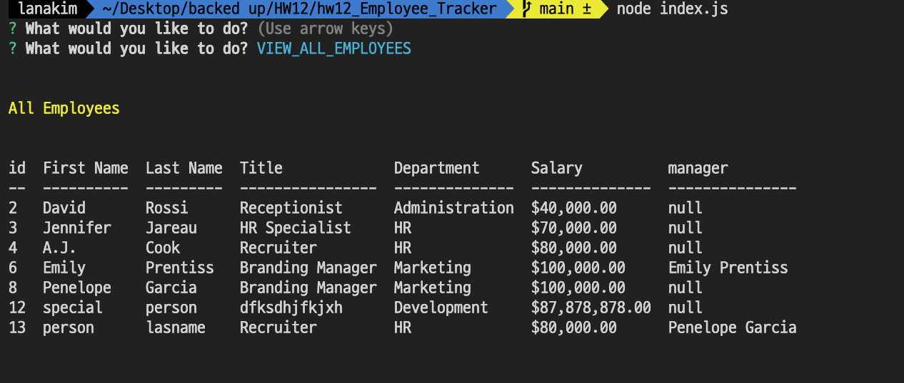
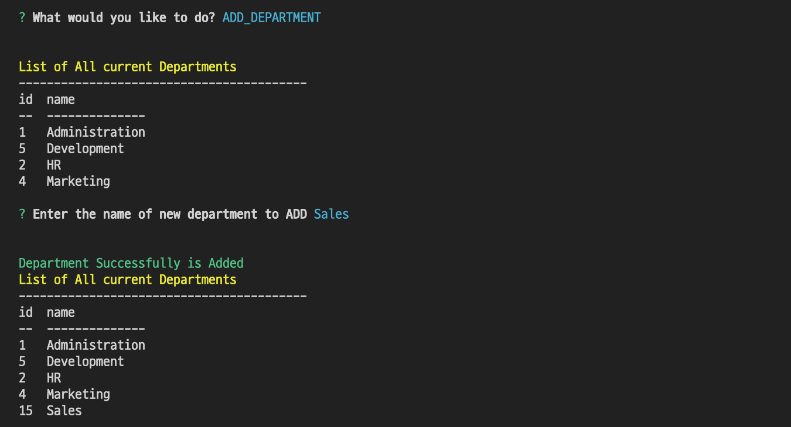

# HW12_Employee_Tracker

[]()

## Table of Contents

- [ Description ](#des)
- [ User Story ](#us)
- [ Database Structure ](#bc)
- [ Installation](#ins)
- [ Demonstration ](#demo)

- [ Tech Used](#tech)
- [ Questions](#q)

## Description <a name="des"></a>

This is a command-line application that can be used to manage employees. This application will use node, inquirer and MYSQL.
You can

- Add departments, roles, employees

- View departments, roles, employees

- Update employee roles

  - Update employee managers

- View employees by manager

- Delete departments, roles, and employees

- View the total utilized budget of a department -- ie the combined salaries of all employees in that department

## User Story <a name="us"></a>

```
I want to be able to view and manage the departments, roles, and employees in my company
So that I can organize and plan my business
```

## Database Structure <a name="bc"></a>


- **department**:

  - **id** - INT PRIMARY KEY
  - **name** - VARCHAR(30) to hold department name

- **role**:

  - **id** - INT PRIMARY KEY
  - **title** - VARCHAR(30) to hold role title
  - **salary** - DECIMAL to hold role salary
  - **department_id** - INT to hold reference to department role belongs to

- **employee**:

  - **id** - INT PRIMARY KEY
  - **first_name** - VARCHAR(30) to hold employee first name
  - **last_name** - VARCHAR(30) to hold employee last name
  - **role_id** - INT to hold reference to role employee has
  - **manager_id** - INT to hold reference to another employee that manages the employee being Created. This field may be null if the employee has no manager

## Installation <a name="ins"></a>

> (1) Assuming you’ve already installed [Node.js](https://nodejs.org/en/) create a directory to hold your application, and make that your working directory.
> `$ mkdir Employee_Tracker $ cd Employee_Tracker `
>
> (2) Install all dependencies
>
> ```
> $ npm i
> ```

> (3) Assuming you've already have MYSQL installed and have account. Create .env file on root level and add

```
DB_PASSWORD=(your Password for MYSQL)
```

> (4) Start app
>
> ```
> $ node index.js
> ```

## Demonstration <a name="demo"></a>




To watch full demo :
[demo link](https://drive.google.com/file/d/1yea8XBjw6Lzi0AaIiDmbtn8sjgzMaiCX/view?usp=sharing)

## Tech Used <a name="tech"></a>

<p>
    
    
    
    
    
</p>

## Questions <a name="q"></a>

- create an issue : <https://github.com/lk9988/hw12_Employee_Tracker/issues>

```

```
